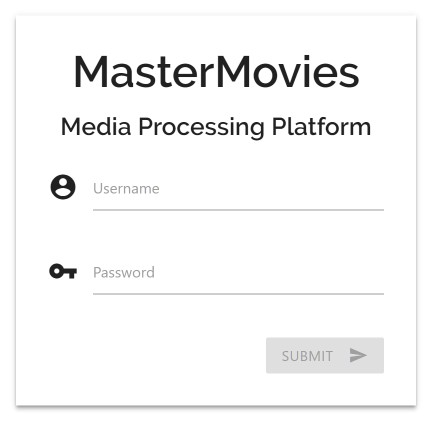
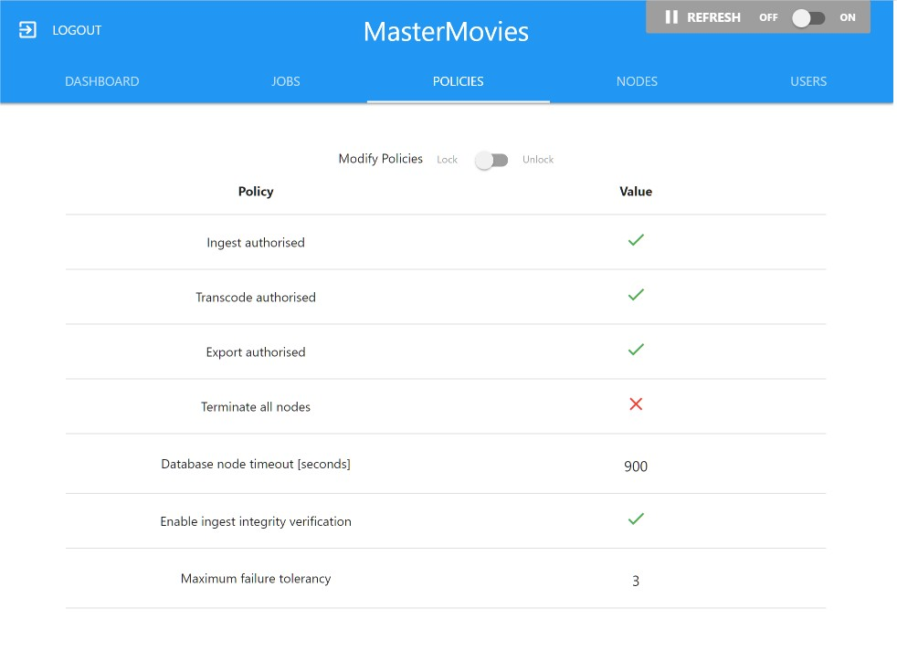
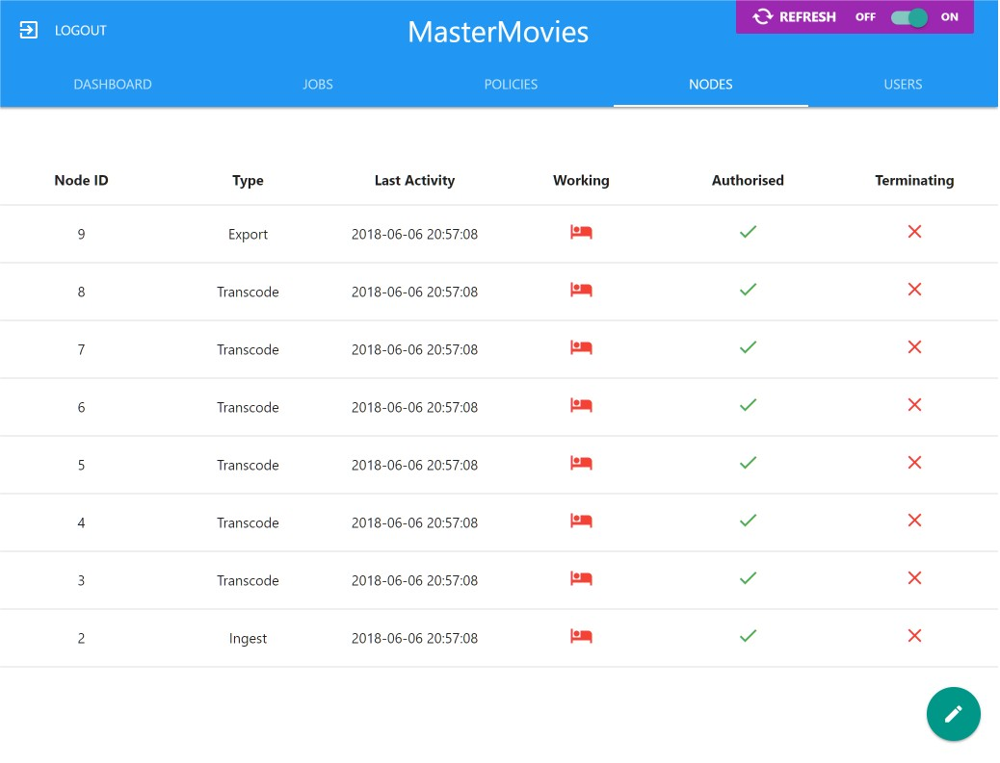
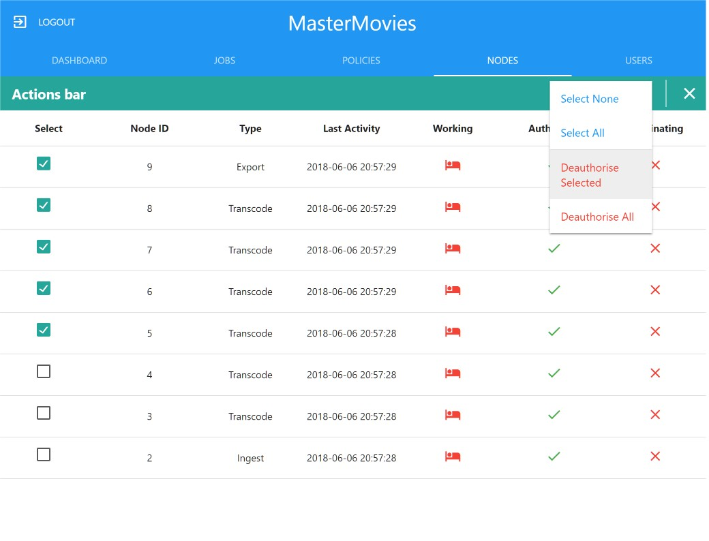

# MasterMovies Media Processing Platform Interface

[](https://travis-ci.org/MarcusCemes/MasterMoviesMPP)
[]()
[](releases)
[]()
[](LICENSE.md)

A HTML based GUI interface to the [MasterMovies Media Processing Platform](https://www.github.com/MarcusCemes/MasterMoviesMPP)






## Getting Started

These instructions will walk you through the pairing process to the [MasterMoviesMPP](https://www.github.com/MarcusCemes/MasterMoviesMPP) network.

### Prerequisites

You will need some sort of LAMP installation. A HTTP server, PHP compile and runtime library and access to the MySQL server used by the [MasterMoviesMPP](https://www.github.com/MarcusCemes/MasterMoviesMPP) network.

### Installing

To install the interface, move the folder to a location on your HTTP web server.

In the *private/database_connection.php* file, modify the following lines with the location of the MySQL server that has the MasterMoviesMPP database:

```
$dbhost = "192.168.___.___";
$dbuser = "node";
$dbpass = "password";
$dbname = "MasterMoviesMPP";
```

That's it! The private folder is protected by the *.htaccess* file.

## Opening the interface

To use the interface, head over to the webpage hosted on your HTTP server. The whole interface is single-page, using PHP pages for dynamic AJAX communication.

### Log-in credentials

Login credentials are securely stored in the interface table on the database. The passwords are hashed using the PHP *password_hash* function. This process is irreversible. Authentication is done by comparing a hashed version of the submitted password to the database entry.

Here is an example of a credential:
```
+----------+--------------------------------------------------------------+
| Username |                           Password                           |
+----------+--------------------------------------------------------------+
| admin    | $2y$10$bPzwKJNKu0qBrI.5vu4K6eFuuWroyoLUWFIdutkcfNVN1QJGrjy5q |
+----------+--------------------------------------------------------------+
```
In this example, you may login with the username 'admin' and the password 'password'.


## Deployment

The web-interface is completely secure. Sessions are handled by PHPs $_SESSION variable, and the database connection variables are protected by a .htaccess configuration.
This interface is still in early development, and does not contain the full functionality that is intended.

## Built With

* [Materialze.css](http://materializecss.com/) - The Materialze CSS Framework
* [Angular.js](https://angularjs.org/) - The Angular.js Javascript Framework
* [PHP](http://www.php.net/) - Handles back-end communication with the MySQL database

## Versioning

We use a relaxed form of [SemVer](http://semver.org/) for versioning. For the versions available, see the [tags on this repository](https://github.com/your/project/tags).

## Authors

* **Marcus Cemes** - *Founder & Project Leader* - [MarcusCemes](https://github.com/MarcusCemes)

## License

This project is licensed under the GPL-3.0 License - see the [LICENSE.md](LICENSE.md) file for details

*TL;DR* You may distribute, modify and use this software for private and commercial purposes, under the condition of preserving the license and copyright status. **Don't steal this.**

## Acknowledgments

* Thanks to [TurboThread](http://www.turbothread.com) for kick-starting this project
